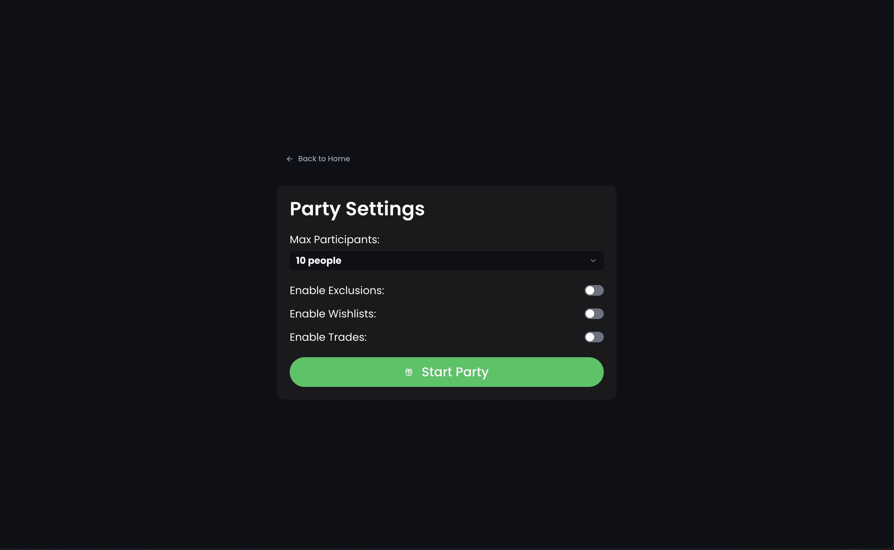
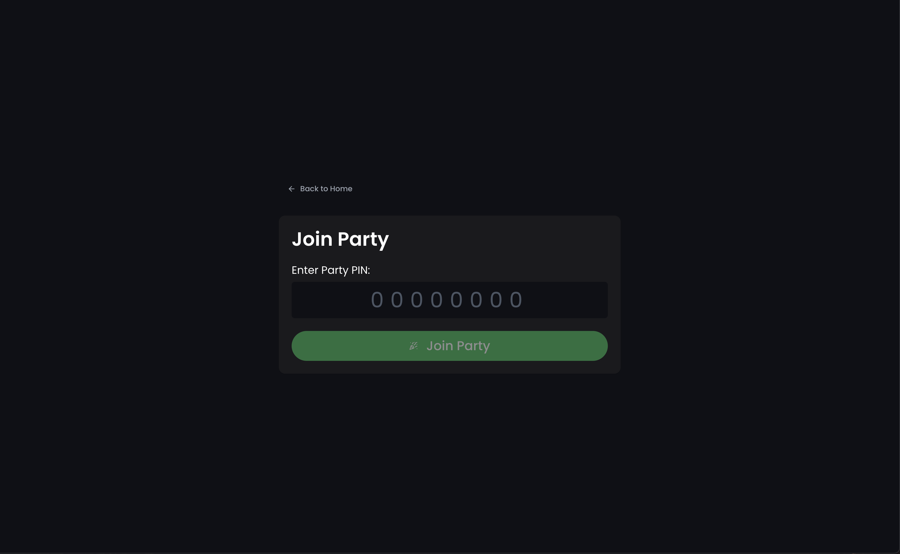

# Secret Gifter 🎁
## WIP
Secret Gifter is Secret Santa without the paper and physical limitations. Think Kahoot, minus the admin accounts, minus the quiz... just pure gift-giving joy!


### App Flow 🎯

#### 1. Create a Party


#### 2. Share with Friends


#### 3. Join the Fun


### Party Features 🎄
1. **Exclusion Lists** 👥
   - Exclude 1-3 people`*` from being your Secret Santa
   - `*`scales with group size
2. **Anonymous Trades** 🔄
   - One-time trading between participants
   - You won't know who you're trading with!
3. **Wishlists** 📝
   - Share what you'd love to receive

### Tech Stack 🛠
- Next.js + React + TypeScript
- Upstash Redis for ephemeral storage
- Tailwind CSS + shadcn

### Local Development 💻
1. Clone the repo
```bash
git clone https://github.com/yourusername/secret-gifter.git
```
2. Install dependencies
```bash
pnpm install
```
3. Set up Upstash
```bash
UPSTASH_REDIS_REST_URL=""
UPSTASH_REDIS_REST_TOKEN=""
```
4. Run it!
```bash
pnpm dev
```

## License 📄
MIT - Do whatever you want with the code, just don't sue us! 😅
```
